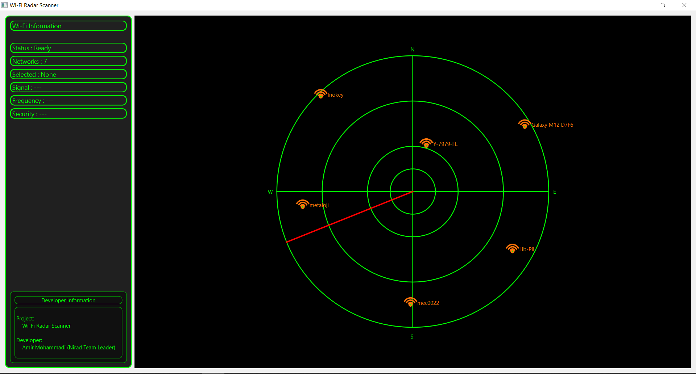

# 📡 Wi-Fi Radar Scanner

A Python-based Wi-Fi scanner application that detects nearby wireless networks and visualizes them on a radar-style graphical interface.

The project combines wireless network scanning, data processing, and GUI development to create an interactive visualization tool for Wi-Fi environments.

---

## 🚀 Demo



---

## 📌 Overview

Wi-Fi Radar Scanner is a desktop application developed in Python that scans nearby Wi-Fi networks and displays them in a radar-like interface.

Each detected network is represented based on:

- Signal strength
- Unique MAC address (BSSID)
- Calculated radar position
- Network information

The goal of this project is to create a simple but visually engaging wireless network monitoring tool.

---

# ✨ Features

## 📡 Wi-Fi Network Detection

- Scan available Wi-Fi networks
- Display:
  - SSID
  - BSSID
  - Signal strength
  - Frequency
  - Security status

## 🟢 Radar Visualization

- Radar-style graphical interface
- Real-time rotating sweep animation
- Network position visualization
- Dynamic target placement


## 🖱️ Interactive Selection

- Click on detected Wi-Fi targets
- Display detailed information about selected networks


## 🖥️ Information Panel

The application provides:

- Number of detected networks
- Selected network information
- Signal strength
- Frequency
- Security type


---

# ⚙️ How It Works

    Wi-Fi Adapter

          |
          |
          v

    PyWiFi Scanner

          |
          |
          v

   Network Processing

          |
          |
          v

    Radar Visualization

          |
          |
          v

    PySide6 GUI

    The application periodically scans the surrounding wireless environment and converts detected networks into radar coordinates.

    The position calculation uses:

    - BSSID-based angle generation
    - Signal strength-based distance estimation


---

# 🏗️ Project Architecture

Wi-Fi Radar Scanner
│
├── app/
│
├── main.py
│ Application entry point
│
├── main_window.py
│ Main GUI window
│
├── radar_widget.py
│ Radar visualization widget
│
├── scanner.py
│ Wi-Fi scanning module
│
├── wifi_worker.py
│ Background scanning thread
│
├── models.py
│ Data structures
│
|── utils.py
| Position calculation utilities
|

---

# 🛠️ Technologies

## Programming Language

- Python 3


## GUI Framework

- PySide6


## Wi-Fi Scanning

- PyWiFi


## Development Concepts

- Object-Oriented Programming
- Multithreading
- GUI Event Handling
- Real-time Visualization
- Data Processing


---

# 📦 Installation


Clone the repository:

```bash
git clone https://github.com/yourusername/wifi-radar-scanner.git
```

Create a virtual environment:
```bash
python -m venv venv
```

Activate environment:
```bash
Windows:
venv\Scripts\activate
```

Install dependencies:
```bash
pip install -r requirements.txt
```

▶️ Usage
Run:
```bash
    python main.py
```

## 🐳 Docker

Build the image:

```bash
docker build -t wifi-radar-scanner .
```

Run the container:

```bash
docker compose up
```

> **Note:** Access to the host's Wi-Fi adapter and graphical display depends on the operating system and Docker configuration. For full functionality, running the application natively is recommended.

---

The application will:

    • Scan nearby Wi-Fi networks
    • Display detected networks on radar
    • Allow selecting networks for detailed information

# 📋 Requirements

Main dependencies:
    - PySide6
    - pywifi
    - comtypes

Full list:
    requirements.txt

# 🔮 Future Improvements

Possible improvements:

    Signal strength filtering
    Smooth target movement
    Wi-Fi signal history graph
    Network database logging
    Export scan results
    Dark/light themes
    Distance estimation improvement
    Better radar animations

# 👨‍💻 Author

    Amir Mohammadi
        Electrical Engineer | Python Developer

    Interested in:
        Embedded Systems
        IoT
        Cyber Security
        Backend Development
        Automation